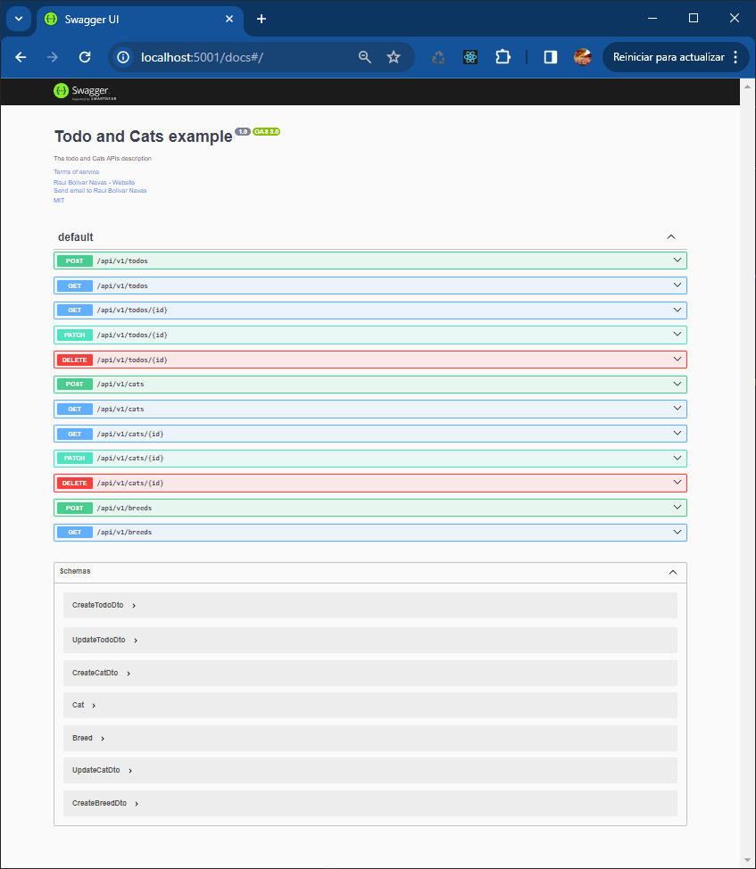

# nest-backend

API REST with NETS.JS for Todo and Cats with Breeds, documentation in Swagger OpenAPI.

---
*@Author: [Raul Bolivar](https://rasysbox.com) - [GitHub](https://github.com/raulrobinson/nest-backend)*
