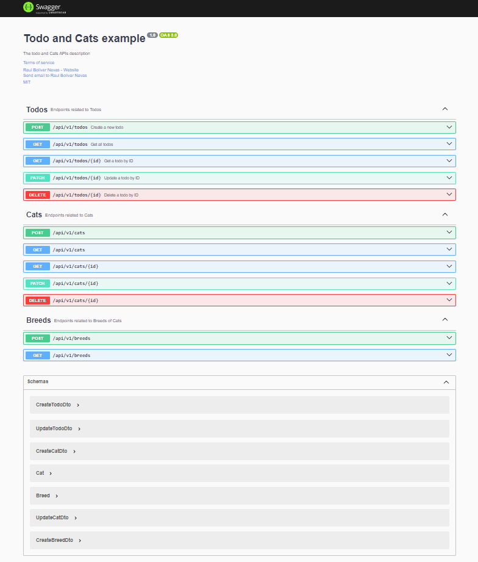

# nest-backend

API REST with NETS.JS for Todo and Cats with Breeds, documentation in Swagger OpenAPI.

- Update Cats Breeds

  ```text
  breed_202404131438.sql
  ```

- Swagger UI

    ```text
    http://localhost:5001/docs
    ```

  


- Swagger JSON

    ```text
    http://localhost:5001/docs-json
    ```
  
   ```json
   {
    "openapi": "3.0.0",
    "paths": {
      "/api/v1/todos": {
        "post": {
          "operationId": "TodosController_create",
          "summary": "Create a new todo",
          "description": "Create a new todo entry",
          "parameters": [],
          "requestBody": {
            "required": true,
            "content": {
              "application/json": {
                "schema": {
                  "$ref": "#/components/schemas/CreateTodoDto"
                }
              }
            }
          },
          "responses": {
            "201": {
              "description": "Todo successfully created"
            }
          },
          "tags": [
            "Todos"
          ]
        },
        "get": {
          "operationId": "TodosController_findAll",
          "summary": "Get all todos",
          "description": "Get a list of all todos",
          "parameters": [],
          "responses": {
            "200": {
              "description": "List of todos successfully retrieved"
            },
            "201": {
              "description": "Todos not content"
            }
          },
          "tags": [
            "Todos"
          ]
        }
      },
      "/api/v1/todos/{id}": {
        "get": {
          "operationId": "TodosController_findOne",
          "summary": "Get a todo by ID",
          "description": "Get a single todo by its ID",
          "parameters": [
            {
              "name": "id",
              "required": true,
              "in": "path",
              "description": "The ID of the todo",
              "schema": {
                "type": "string"
              }
            }
          ],
          "responses": {
            "200": {
              "description": "Todo successfully retrieved"
            },
            "404": {
              "description": "Todo not found"
            }
          },
          "tags": [
            "Todos"
          ]
        },
        "patch": {
          "operationId": "TodosController_update",
          "summary": "Update a todo by ID",
          "description": "Update an existing todo by its ID",
          "parameters": [
            {
              "name": "id",
              "required": true,
              "in": "path",
              "description": "The ID of the todo",
              "schema": {
                "type": "string"
              }
            }
          ],
          "requestBody": {
            "required": true,
            "content": {
              "application/json": {
                "schema": {
                  "$ref": "#/components/schemas/UpdateTodoDto"
                }
              }
            }
          },
          "responses": {
            "200": {
              "description": "Todo successfully updated"
            },
            "404": {
              "description": "Todo not found"
            }
          },
          "tags": [
            "Todos"
          ]
        },
        "delete": {
          "operationId": "TodosController_remove",
          "summary": "Delete a todo by ID",
          "description": "Delete an existing todo by its ID",
          "parameters": [
            {
              "name": "id",
              "required": true,
              "in": "path",
              "description": "The ID of the todo",
              "schema": {
                "type": "string"
              }
            }
          ],
          "responses": {
            "200": {
              "description": "Todo successfully deleted"
            },
            "404": {
              "description": "Todo not found"
            }
          },
          "tags": [
            "Todos"
          ]
        }
      },
      "/api/v1/cats": {
        "post": {
          "operationId": "CatsController_create",
          "parameters": [],
          "requestBody": {
            "required": true,
            "content": {
              "application/json": {
                "schema": {
                  "$ref": "#/components/schemas/CreateCatDto"
                }
              }
            }
          },
          "responses": {
            "201": {
              "description": "",
              "content": {
                "application/json": {
                  "schema": {
                    "$ref": "#/components/schemas/Cat"
                  }
                }
              }
            }
          },
          "tags": [
            "Cats"
          ]
        },
        "get": {
          "operationId": "CatsController_findAll",
          "parameters": [],
          "responses": {
            "200": {
              "description": "",
              "content": {
                "application/json": {
                  "schema": {
                    "type": "array",
                    "items": {
                      "$ref": "#/components/schemas/Cat"
                    }
                  }
                }
              }
            }
          },
          "tags": [
            "Cats"
          ]
        }
      },
      "/api/v1/cats/{id}": {
        "get": {
          "operationId": "CatsController_findOne",
          "parameters": [
            {
              "name": "id",
              "required": true,
              "in": "path",
              "schema": {
                "type": "string"
              }
            }
          ],
          "responses": {
            "200": {
              "description": "",
              "content": {
                "application/json": {
                  "schema": {
                    "$ref": "#/components/schemas/Cat"
                  }
                }
              }
            }
          },
          "tags": [
            "Cats"
          ]
        },
        "patch": {
          "operationId": "CatsController_update",
          "parameters": [
            {
              "name": "id",
              "required": true,
              "in": "path",
              "schema": {
                "type": "string"
              }
            }
          ],
          "requestBody": {
            "required": true,
            "content": {
              "application/json": {
                "schema": {
                  "$ref": "#/components/schemas/UpdateCatDto"
                }
              }
            }
          },
          "responses": {
            "200": {
              "description": "",
              "content": {
                "application/json": {
                  "schema": {
                    "type": "object"
                  }
                }
              }
            }
          },
          "tags": [
            "Cats"
          ]
        },
        "delete": {
          "operationId": "CatsController_remove",
          "parameters": [
            {
              "name": "id",
              "required": true,
              "in": "path",
              "schema": {
                "type": "string"
              }
            }
          ],
          "responses": {
            "200": {
              "description": ""
            }
          },
          "tags": [
            "Cats"
          ]
        }
      },
      "/api/v1/breeds": {
        "post": {
          "operationId": "BreedsController_create",
          "parameters": [],
          "requestBody": {
            "required": true,
            "content": {
              "application/json": {
                "schema": {
                  "$ref": "#/components/schemas/CreateBreedDto"
                }
              }
            }
          },
          "responses": {
            "201": {
              "description": "",
              "content": {
                "application/json": {
                  "schema": {
                    "$ref": "#/components/schemas/Breed"
                  }
                }
              }
            }
          },
          "tags": [
            "Breeds"
          ]
        },
        "get": {
          "operationId": "BreedsController_findAll",
          "parameters": [],
          "responses": {
            "200": {
              "description": "",
              "content": {
                "application/json": {
                  "schema": {
                    "type": "array",
                    "items": {
                      "$ref": "#/components/schemas/Breed"
                    }
                  }
                }
              }
            }
          },
          "tags": [
            "Breeds"
          ]
        }
      }
    },
    "info": {
      "title": "Todo and Cats example",
      "description": "The todo and Cats APIs description",
      "version": "1.0",
      "contact": {
        "name": "Raul Bolivar Navas",
        "url": "https://rasysbox.com",
        "email": "rasysbox@hotmail.com"
      },
      "license": {
        "name": "MIT",
        "url": "https://opensource.org/licenses/MIT"
      },
      "termsOfService": "https://www.linkedin.com/in/rasysbox"
    },
    "tags": [
      {
        "name": "Todos",
        "description": "Endpoints related to Todos"
      },
      {
        "name": "Cats",
        "description": "Endpoints related to Cats"
      },
      {
        "name": "Breeds",
        "description": "Endpoints related to Breeds of Cats"
      }
    ],
    "servers": [],
    "components": {
      "schemas": {
        "CreateTodoDto": {
          "type": "object",
          "properties": {
            "title": {
              "type": "string"
            },
            "description": {
              "type": "string"
            }
          },
          "required": [
            "title",
            "description"
          ]
        },
        "UpdateTodoDto": {
          "type": "object",
          "properties": {
            "title": {
              "type": "string"
            },
            "description": {
              "type": "string"
            }
          },
          "required": [
            "title",
            "description"
          ]
        },
        "CreateCatDto": {
          "type": "object",
          "properties": {
            "name": {
              "type": "string"
            },
            "age": {
              "type": "number",
              "minimum": 1
            },
            "breed": {
              "type": "string"
            }
          },
          "required": [
            "name",
            "age",
            "breed"
          ]
        },
        "Cat": {
          "type": "object",
          "properties": {
            "id": {
              "type": "number"
            },
            "name": {
              "type": "string"
            },
            "age": {
              "type": "number"
            },
            "breed": {
              "$ref": "#/components/schemas/Breed"
            },
            "deletedAt": {
              "format": "date-time",
              "type": "string"
            }
          },
          "required": [
            "id",
            "name",
            "age",
            "breed",
            "deletedAt"
          ]
        },
        "Breed": {
          "type": "object",
          "properties": {
            "id": {
              "type": "number"
            },
            "name": {
              "type": "string"
            },
            "cats": {
              "type": "array",
              "items": {
                "$ref": "#/components/schemas/Cat"
              }
            },
            "deletedAt": {
              "format": "date-time",
              "type": "string"
            }
          },
          "required": [
            "id",
            "name",
            "cats",
            "deletedAt"
          ]
        },
        "UpdateCatDto": {
          "type": "object",
          "properties": {
            "name": {
              "type": "string"
            },
            "age": {
              "type": "number",
              "minimum": 1
            },
            "breed": {
              "type": "string"
            }
          }
        },
        "CreateBreedDto": {
          "type": "object",
          "properties": {
            "name": {
              "type": "string",
              "minLength": 1
            }
          },
          "required": [
            "name"
          ]
        }
      }
    }
  }
   ```

---
*@Author: [Raul Bolivar](https://rasysbox.com) - [GitHub](https://github.com/raulrobinson/nest-backend)*
